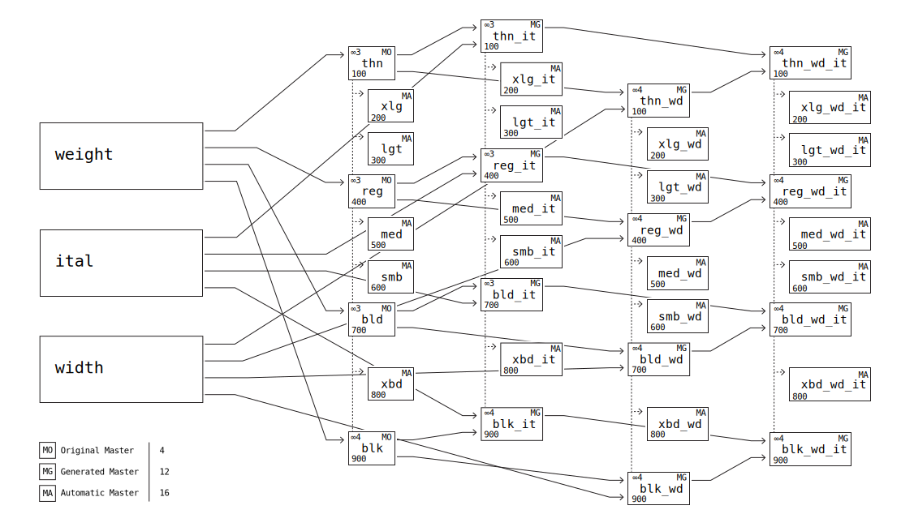

## **Preface**

**Advent** is a project of **VivaRado**, thanks goes to all the contributors, **Google Fonts** and all the people who use it!


### **Contents**

1.  **Preface**
1.  **Introduction**
    1.  **Profile**
    1.  **Project Overview**
        1.  **Background**
        1.  **Need**
    1.  **Organisational Documents**
    1.  **Phase Introduction**
        1.  **Initiation Phase**
            1.  **Business Case**
                1.  **Solution Options**
                1.  **Strategic case**
                1.  **Management case**
                    1.  **Achievements Plan**
            1.  **Project Charter**
                1.  **Project Introduction**
                    1.  **Project Statements**
                1.  **Project Goals** 
                1.  **Deliverables**
                1.  **Duration** 
        1.  **Planning Phase**
            1.  **Safe Planning**
                1.  **Project Plan**
                    1.  **Design**
                    1.  **Production**
                    1.  **Masters and Instances**
                    1.  **Kerning**
                    1.  **Components**
                    1.  **Scripts**
                    1.  **Glyphs**
                    1.  **Features**
                    1.  **Delivery**
                    1.  **Usage**
                1.  **Work Planning**
                    1.  **Task Assignments**
                    1.  **Dependencies**
                1.  **Schedule Planning**
                    1.  **Timeline**
            1.  **Stakeholders**
                1.  **Personnel Plan**
                1.  **Communication Plan**
            1.  **Quality Plan**
                1.  **Quality Targets**
                1.  **Quality Management**

### Glossary

1.  **Glossary**

### Reference

1.  **Reference**


##  **Introduction**

Advent Pro is a modern display typeface, designed in 2007, this is the new version (#3.001 of 2019) that is delivered as a variable font, along with the classic formats. It supports 14 weights including italics. It is currently maintained and released by VivaRado, by it's original designer Andreas Kalpakidis. What is unique about this version is that thanks to the strict requirements of the Variable Format, all the glyph contours have been reworked, with amazing attention to quality. Then we compressed the kerning to a great degree making the font superbly kerned and compact at the same time.

#### Contributors:

*  VivaRado 
*  Andreas Kalpakidis
*  Madina Akhmatova
*  Dave Crossland
*  Michael LaGattuta 
*  Behdad Esfahbod

---

### **Introduction / Profile**

*   Company: VivaRado LLP
*   Designer: Andreas Kalpakidis
*   Twitter: [@vivarado](https://twitter.com/VivaRado)
*   Google Group:[VivaRado Typography Google Group](https://groups.google.com/a/vivarado.com/forum/#!forum/typography)


---


### **Introduction / Project Overview**

*  Project Overview
	*  background
	*  need
	*  scope
	*  activities
	*  important dates or deadlines

*   Project Name: Advent Pro Variable
*   Type family name: Advent Pro Var (Advent Professional Variable)
*   Proposal Date: 22/08/2018

---

### **Introduction / Project Overview / Background**

Advent was originally designed during a two year period by Andreas Kalpakidis, in Athens and later in Komotini, Greece during 2006 to 2007. It was an attempt to break some of the Greek script rules and some of the Latin script rules on letterform grouping. All the letters have been in a sense simplified, and Greek Letters where fitted into Latin groups visually. The overall designed was intended to be light, the font is not intended for text but for headlines, logos, and other short message formats as a display font.

---

### **Introduction / Project Overview / Need**

During 2007 there was a common problem of lack of Greek fonts, even though some agencies took this as an opportunity, Advent was released for free. It was a project that never intended to be something other than an expression of a minimal typographic style.


---


### **Introduction / Organisational Documents**

Documentation Types:

*  HTML - Responsive preview in HTML format - At README directory
*  Standard Repository README - At the root of the repository
*  PDF - At the root of the repository

Features:

*  Responsive Interface
*  Synchronized Sidebar
*  Hashtag Navigation
*  PDF with TOC and Cover

Drawbacks:

*  Graphs and Diagrams will not work in github and bitbucket preview, but are still readable.
*  Graphs and Diagrams will not work in PDF will be assessed.


---

### **Introduction / Phase Introduction**

**Initiation Phase**:

This documentation being part of VivaRado ORGDOC has been implemented over the old advent documentation. Advent itself since 2007 had no real repository or vendor entity other than it was on release by multiple websites for free fonts.

---

**Planning Phase**:

All the information on how Advent was updated, produced and offered.


---

### **Introduction / Phase Introduction / Initiation Phase**

**Business Case**:

What are the benefits we are trying to get from the project and justification of the decision. It encapsulates the research done to see if the project is worth doing.

---


*  **Initiation Phase** Components ∞0.001:
	
	1.  **Business Case**:
		*  Strategic case
		*  Management case

---

### **Introduction / Phase Introduction / Initiation Phase / Business Case**

A business case captures the reasoning for initiating the redesign and variation of Advent.

*  **Business Case** Components ∞0.003:
	1.  **Solution Options**
	1.  **Strategic case**
	1.  **Management case**


---

### **Introduction / Phase Introduction / Initiation Phase / Business Case / Solution Options**

Identified Solution Options:
	
*  Update the old Advent Font to Variable.
*  Redesign the old Advent Font to Variable and Include Italics.

---

### **Introduction / Phase Introduction / Initiation Phase / Business Case / Strategic case**

During the initiation of the redesign of Advent, VivaRado as the current vendor, had to undergo a tool design process, as there was a clear need for faster integration of the new design, we realised that we needed a tool to somehow control the decentralised, but very helpful UFO format.

---

### **Introduction / Phase Introduction / Initiation Phase / Business Case / Management case**

The management case tests the feasibility of the preferred option, in terms of its deliverability within various tolerances. 


#### Achievability:

By implementing a set of scripts that are now part of VRD TYPL. We could manage a set of UFOs by combining the repeated parts, and keeping them as intact as possible in terms of the UFO format, we introduced internally the EFO as a pseudoformat that allows for implementation of scripts on a whole family of weights. This allowed us to overcome the decentralisation of UFOs and move forward and produce Advent successfully.

---

### **Introduction / Phase Introduction / Initiation Phase / Business Case / Management case / Achievements Plan**

1.  **Milestones**
	1.  VRD TYPL
	1.  VRD TYPL / TypeFacet Integration
	1.  Fontmake Kerning Bug Solution
1.  **Dependencies**
	1.  UFO
	1.  TypeFacet Autokern
	1.  Fontmake
1.  **Skillset Requirements**
	1.  Variable Font comprehension.
	1.  Python Programming
	1.  Web Application Development
	1.  Type Design
	1.  Kerning Classification
	1.  Kerning Compression

#### Fontbakery Gave us a Cupcake:

```
       .,@@'
    .@@@@..@@@@.
  .@@,  .@ .  .@@, 
.@@.@`  ,.@.,'  '@@@
@    "@'      '@"  @
:@@@..@. ,@..@.@@.,@
  \\ ||@@' |||| //
   || |||| ||| ||
    \\ ||| || //
     ||||||||||

 Advent Cupcake Day
   April 13 2019

```

Image CupCake, Actual Cupcake Fairly Larger. Objects in ANSI are larger than they appear.


---

### **Introduction / Phase Introduction / Initiation Phase / Project Charter**


*  **Project Charter** Components ∞0.002:
	*  Project Introduction
	*  Project Goals
	*  Deliverables
	*  Duration

---

### **Introduction / Phase Introduction / Initiation Phase / Project Charter / Project Introduction**

*  **Project Introduction** Components ∞0.002:

	*  Project Name
	*  Project Statements
		*  Vision Statement
		*  Mission Statement
	*  Project Definition
		*  Problem 
		*  Opportunity

---

### **Introduction / Phase Introduction / Initiation Phase / Project Charter / Project Introduction / Project Statements**

####  Vision Statement:
	
Contribution to libre great typography.

####  Mission Statement:
	
To expand our ideas about typography and contribute to language.


---


### **Introduction / Phase Introduction / Initiation Phase / Project Charter / Project Introduction / Project Definition**

*  **Problem** Components ∞0.001:
	*  Problematic Vectors
	*  Dirty Contours
	*  Old Format

*  **Opportunity** Components ∞0.001:
	*  New Variable Font Format
	*  Cleaner Contrours
	*  Compression Concepts
	*  Lighter Offering

---

### **Introduction / Phase Introduction / Initiation Phase / Project Charter / Project Goals**

*  Goals for ∞ 3.000:
	*  To bring an updated Advent Pro to the Variable format, 
	*  Add Italics Axes
	*  Add Weight Axes
*  Goals for ∞ 4.000:
	*  Add Cyrillic
	*  Add Width Axes
	*  Add Optical Size Axes

---


### **Introduction / Phase Introduction / Initiation Phase / Project Charter / Deliverables**

*  **Deliverables** Components ∞0.001:
	*  Advent Pro Variable:
		*  Variation Weight Axes
		*  Variation Italic Axes
	*  Advent Pro 14 Weights:
		*  Classic Formats (TTF, OTF, ...)
	*  VRD-Typography-Library:
		*  EFO to UFOs
		*  UFOs to EFO
		*  EFO to VAR
		*  Kerning Extract Similarity (SIMEX)
		*  Kerning Autokern
		*  Kerning Compress FlatD
		*  Componentize EFO
		*  Kerning Adjust UI

	
---

### **Introduction / Phase Introduction / Initiation Phase / Project Charter / Duration**

*  **Duration** of Advent ∞3.000:
	*  22/08/2018 to 16/02/2019

*  **Duration** of Advent ∞4.000:
	*  April 1st 2019 to December 20th 2019

---


### **Introduction / Phase Introduction / Planning Phase**

The Planning Phase, is where the project solution is further developed in as much detail as possible and the steps necessary to meet the project’s objectives.

The Planning Phase consists of:

1.  **Safe Planning**
1.  **Stakeholders**
1.  **Quality Plan (PQP)**


At this point, the project would have been planned in detail and is ready to be executed.

---

### **Introduction / Phase Introduction / Planning Phase / Safe Planning**

The project's **Work Planning / Project Plan** is created outlining the activities, tasks, dependencies, and timeframes.


*  **Safe Planning** Components (Scope Management): 

	*  Projeect Plan:
	*  Work Planning:
		*  Tasks Assignments
		*  Dependencies
	*  Schedule Planning.
		*  Timeline

---

### **Introduction / Phase Introduction / Planning Phase / Safe Planning / Project Plan**

Decide on the encoding sets and supported language scripts. Decide and plan the weights and how you will generate each weight. Understand the procedures and steps. Calculate or keep track of timelines, steps procedures and pitfalls.

1.  **Project Plan** Components ∞0.001:
	1.  **Design**
	1.  **Production**
	1.  **Masters and Instances**
	1.  **Kerning**
	1.  **Components**
	1.  **Language Scripts and Glyph Range**
	1.  **Features**
	1.  **Delivery**

---

### **Introduction / Phase Introduction / Planning Phase / Safe Planning / Project Plan / Design**

Advent originally featured 7 weights of geometric sharp curved high rise forms and modernized Greek Letters. This realease features 14 weights, the original updated and improved forms along with italics.

---

### **Introduction / Phase Introduction / Planning Phase / Safe Planning / Project Plan / Production**

To produce the font, Illustrator and Fontlab was used originally in 2007, updating to Advent  Pro Variable in 2018, a set of scripts for Adobe Illustrator (JSX) and Fontlab (Python) where written, additionally python scripts and bash, for the composition and kerning. Later on VRD Typography Library was introduced allowing for easier modifications to the font by utilizing a new format - a container for UFO, called the EFO. VRD TYPL for kerning - and compression and Googles fontmake to compile the final variable font. 

Work was done on a Linux box with VirtualBox running Windows 8 and Mac OSX Lion.

---

### **Introduction / Phase Introduction / Planning Phase / Safe Planning / Project Plan / Masters and Instances**

The diagram shows the Original Masters (MO), Generated Masters (MG) that get adjusted manually and the automatically generated instances (MA).




image: #001, 0.002, svg, Advent Masters and Instances sankey.

---

#### Masters

| name                  | weight | size             | version   |
| --------------------- | ------ | ---------------- | --------- |
| Thin Normal           | 100    | 8pt, 24pt, 144pt | 3.000     |
| Regular Normal        | 400    | 8pt, 24pt, 144pt | 3.000     |
| Bold Normal           | 700    | 8pt, 24pt, 144pt | 3.000     |
| Black Normal          | 700    | 8pt, 24pt, 144pt | **4.000** |
| Thin Wide             | 100    | 8pt, 24pt, 144pt | **4.000** |
| Regular Wide          | 400    | 8pt, 24pt, 144pt | **4.000** |
| Bold Wide             | 700    | 8pt, 24pt, 144pt | **4.000** |
| Black Wide            | 700    | 8pt, 24pt, 144pt | **4.000** |
| Thin Italic Normal    | 100    | 8pt, 24pt, 144pt | 3.000     |
| Regular Italic Normal | 400    | 8pt, 24pt, 144pt | 3.000     |
| Bold Italic Normal    | 700    | 8pt, 24pt, 144pt | 3.000     |
| Black Italic Normal   | 700    | 8pt, 24pt, 144pt | **4.000** |
| Thin Italic Wide      | 100    | 8pt, 24pt, 144pt | **4.000** |
| Regular Italic Wide   | 400    | 8pt, 24pt, 144pt | **4.000** |
| Bold Italic Wide      | 700    | 8pt, 24pt, 144pt | **4.000** |
| Black Italic Wide     | 700    | 8pt, 24pt, 144pt | **4.000** |

#### Instances

| acro      | weight | name                             | master | version   |
| --------- | ------ | -------------------------------- | ------ | --------- |
| thn       | 100    | Thin (Hairline)                  | MO     | 3.000     |
| xlg       | 200    | Extra Light (Ultra Light)        | MA     | 3.000     |
| lgt       | 300    | Light                            | MA     | 3.000     |
| reg       | 400    | Regular                          | MO     | 3.000     |
| med       | 500    | Medium                           | MA     | 3.000     |
| smb       | 600    | Semi Bold (Demi Bold)            | MA     | 3.000     |
| bld       | 700    | Bold                             | MO     | 3.000     |
| xbd       | 800    | Extra Bold (Ultra Bold)          | MA     | 3.000     |
| blk       | 900    | Black (Heavy)                    | MO     | **4.000** |
| thn-wd    | 100    | Thin (Hairline)                  | MG     | **4.000** |
| xlg-wd    | 200    | Extra Light (Ultra Light)        | MA     | 3.000     |
| lgt-wd    | 300    | Light                            | MA     | 3.000     |
| reg-wd    | 400    | Regular                          | MG     | **4.000** |
| med-wd    | 500    | Medium                           | MA     | 3.000     |
| smb-wd    | 600    | Semi Bold (Demi Bold)            | MA     | 3.000     |
| bld-wd    | 700    | Bold                             | MG     | **4.000** |
| xbd-wd    | 800    | Extra Bold (Ultra Bold)          | MA     | 3.000     |
| blk-wd    | 900    | Black (Heavy)                    | MG     | **4.000** |
| thn-it    | 100    | Italic Thin (Hairline)           | MG     | 3.000     |
| xlg-it    | 200    | Italic Extra Light (Ultra Light) | MA     | 3.000     |
| lgt-it    | 300    | Italic Light                     | MA     | 3.000     |
| reg-it    | 400    | Italic Regular                   | MG     | 3.000     |
| med-it    | 500    | Italic Medium                    | MA     | 3.000     |
| smb-it    | 600    | Italic Semi Bold (Demi Bold)     | MA     | 3.000     |
| bld-it    | 700    | Italic Bold                      | MG     | 3.000     |
| xbd-it    | 800    | Extra Bold (Ultra Bold)          | MA     | 3.000     |
| blk-it    | 900    | Black (Heavy)                    | MG     | **4.000** |
| thn-wd-it | 100    | Italic Thin (Hairline)           | MG     | **4.000** |
| xlg-wd-it | 200    | Italic Extra Light (Ultra Light) | MA     | 3.000     |
| lgt-wd-it | 300    | Italic Light                     | MA     | 3.000     |
| reg-wd-it | 400    | Italic Regular                   | MG     | **4.000** |
| med-wd-it | 500    | Italic Medium                    | MA     | 3.000     |
| smb-wd-it | 600    | Italic Semi Bold (Demi Bold)     | MA     | 3.000     |
| bld-wd-it | 700    | Italic Bold                      | MG     | **4.000** |
| xbd-wd-it | 800    | Extra Bold (Ultra Bold)          | MA     | 3.000     |
| blk-wd-it | 900    | Black (Heavy)                    | MG     | **4.000** |

#### Axes

| axes                                        | version   |
| ------------------------------------------- | --------- |
| weight axes only                            | 3.000     |
| italic axes with weight axes                | 3.000     |
| weight and italic axes                      | 3.000     |
| weight and width                            | **4.000** |
| width axes only                             | **4.000** |
| italic axes with weight axes and width axes | **4.000** |
| optical Size                                | **4.000** |

---

An example of what we are planning in terms of the new Black MO (Original Master) and new Wide MO. The wide version is planned to be **20% Wider** compared to the current normal and the black version is planned to be **60% Bolder** compared to the current bold.


image: #002, 0.002, svg, Advent MO and MG Masters.

---

### **Introduction / Phase Introduction / Planning Phase / Safe Planning / Project Plan / Kerning**

With the help of Typefacet Integrated Autokern, we have obtained the first layer of kerning for the upright bold.
By using VRD TYPL Kerning Adjust, 
we made the corrections, and the rest of the optimisations required per weight.

We have Classified our glyphs in a way where no kerning loss is observed. By dividing by Language Set, without language intrusion between classes.
Small Case and Capitals are also non intruding. This increases size minimally but maintains kerning pair loss at zero.

During the process we attempted to maintain the Italics width according to the contour. This created a larger alteration size and jittering italics transition due to changing width - even if the kerning was precise. We eventually opted for the slant-to-right-side-corner and maintained the regular kerning along to the italics and smoother animation on Italics.

---

### **Introduction / Phase Introduction / Planning Phase / Safe Planning / Project Plan / Kerning / Standard Sets**

All the letter combinations have been kerned but we also perform testing afterwards, for various reasons (Ommited) some kerning pairs are not included. This brings us to testing the kerning on a specific set of letters, the other letters are left to maintain the mechanical, automated kerning.

VivaRado standard kerning sets are defined as follows:

 - Letter Based(LB):

	- Latin Capitals(LBLC):
	  - ```A B C D E F G H I J K L M N O P Q R S T U V W X Y Z```
	- Latin SmallCase(LBLS):
	  - ```a b c d e f g h i j k l m n o p q r s t u v w x y```
	- Greek (GREEK UNICODES)(LBGC):
	  - ```Α Β Γ Δ Ε Ζ Η Θ Ι Κ Λ Μ Ν Ξ Ο Π Ρ Σ Τ Υ Φ Χ Ψ Ω```
	- Greek SmallCase(LBGS):
	  - ```α β γ δ ε ζ η θ ι κ λ μ ν ξ ο π ρ σ ς τ υ φ χ ψ ω```
	- Numbers(LBNU):
	  - ```0 1 2 3 4 5 6 7 8 9```

 - Resulting Permutations that have been Adjusted:

	- Letter Based Permutations (LB):

	  - Latin VS Latin Capitals Letter Based Permutation (LBLCLC)
	  - Latin VS Latin SmallCase Letter Based Permutation (LBLSLS)
	  - Latin Capitals VS Latin SmallCase Letter Based Permutation (LBLCLS)

	  - Greek VS Greek Capitals Letter Based Permutation (LBGCGC)
	  - Greek VS Greek SmallCase Letter Based Permutation (LBGSGS)
	  - Greek Capitals VS Greek SmallCase Letter Based Permutation (LBGCGS)

 - Letter to Letter Adjustments:
	- These are small adjustments due to design quirks, and when we decide that a glyph doesn't fit into classes or the class is not satisfying the kerning requirements completely.
 - Ommited:
	- Cross Language System Kerning (grek to latn and latn to grek).
	- Greek "sigma1" on the Left Side for all grek.

---

### **Introduction / Phase Introduction / Planning Phase / Safe Planning / Project Plan / Kerning / Results**

The resulting kerning is:

```{'GG': 4458, 'GL': 761, 'LG': 708, 'LL': 166}```

Total Pairs: ```6093```


More information in: [Kerning Pair Details](https://github.com/VivaRado/Advent/blob/master/docs/kerning_adjustments/kerning_pair_details)

**If you notice a possible kerning improvement we would like to hear about it.**


---

### **Introduction / Phase Introduction / Planning Phase / Safe Planning / Project Plan / Components**

Components are created by first running VRD/TYPL/SIMEX to obtain a component similarity index, then VRD/TYPL/COMPONENTS to Componentize the EFO,
later you can export to Componentized UFOs.

---

### **Introduction / Phase Introduction / Planning Phase / Safe Planning / Project Plan / Scripts**

At this moment advent supports Latin, and Greek Encoding as ∞3.000.

*  **Version ∞3.000**:
	*  **Current Character Support:**
		*  *Latin*
		*  *Extended Latin*
		*  *Greek*
		*  *Baltic*
		*  *Turkish*

	*  **Intended Character Support:**

		*  The Proposed Encoding/Glyph List: /encoding_list/suggested_encoding.py
		*  Current Encoding/Glyph List: /encoding_list/current_encoding.enc

*  **Version ∞4.000**:
	*  *Google Latin Plus*
	*  *Google Cyrillic Plus*
	*  *Google Greek*
	*  *Opentype Features Glyphs*

[Encoding NAM Files](https://github.com/googlefonts/gftools/tree/master/Lib/gftools/encodings)

---

### **Introduction / Phase Introduction / Planning Phase / Safe Planning / Project Plan / Glyphs**

*  **Version ∞3.000**:
	
	The glyph range is ≃ 391

*  **Version ∞4.000**:
	
	The glyph range is ≃ 647

---

### **Introduction / Phase Introduction / Planning Phase / Safe Planning / Project Plan / Features**

Advent features at this moment include:

*  liga:

	*  sub f l by fl;
	*  sub f i by fi;
	*  sub f f l by ffl;
	*  sub f t by ft;
	*  sub t t by t_t;
	*  sub w w w by w_w_w;
	*  sub gamma gamma by gamma_gamma;
	*  sub gamma kappa by gamma_kappa;
	*  sub lambda lambda by lambda_lambda;

---

### **Introduction / Phase Introduction / Planning Phase / Safe Planning / Project Plan / Hinting**

TrueType Hints

---

### **Introduction / Phase Introduction / Planning Phase / Safe Planning / Project Plan / Delivery**

Advent Pro Variable will be delivered in 7 Weights & 7 Italic Weights and Variable format. All the Adobe Illustrator scripts, Fontlab Python and additional scripts will be provided. Forks of the original libraries with their alterations, and Encoding Files.

The delivered font files are provided in UFO, WOFF, WOFF2, OTF, TTF, EFO.

All the above files are available here.

Variable font flavors designspace:
 - [Variable with weight axes only](https://github.com/VivaRado/Advent/blob/master/font_source/UFOs/weight.designspace)
 - [Variable italic with weight axes](https://github.com/VivaRado/Advent/blob/master/font_source/UFOs/italic.designspace)
 - [Variable with weight and italic axes](https://github.com/VivaRado/Advent/blob/master/font_source/UFOs/weight_italic.designspace)

---

### **Introduction / Phase Introduction / Planning Phase / Safe Planning / Project Plan / Usage**

To compile from UFO:

```fontmake -o variable -m '/font.designspace' --output-path '/adventpro-VF.ttf'```

Or from EFO:

```python3 '/efo_to_var.py' -s '/font_source/EFO' -o '/adventpro-VF.ttf'```


---

### **Introduction / Phase Introduction / Planning Phase / Safe Planning / Work Planning**


#### Kerning Work Breakdown Structure


diagram: #006, ∞0.001, mermaid, Work Breakdown Structure of Advent for Kerning.

---


### **Introduction / Phase Introduction / Planning Phase / Safe Planning / Work Planning / Task Assignments**

*  **Assumptions Research**:
	*  VivaRado, Andreas Kalpakidis (∞3,4)
*  **Docs Update**:
	*  VivaRado, Andreas Kalpakidis (∞3,4):
		*  Identify Dependencies
		*  Identify Resource Requirements
	*  VivaRado, Madina Akhmatova (∞3,4)
*  **Advent**:
	*  **Design**
		*  VivaRado, Andreas Kalpakidis (∞1,2,3,4)
	*  **Componentization**
		*  VivaRado, Andreas Kalpakidis (∞3,4)
		*  Michael La Gatutta (∞3)
	*  **Kerning**
		*  VivaRado, Andreas Kalpakidis (∞3,4):
			*  Build
			*  Test
		*  Michael La Gatutta (∞3):
			*  Best Practices
*  **VRD TYPL**:
	*  VivaRado, Andreas Kalpakidis (∞3,4):
		*  Build
		*  Test
	*  VivaRado, Madina Akhmatova (∞3,4):
		*  Compression Logic

---

### **Introduction / Phase Introduction / Planning Phase / Safe Planning / Work Planning / Dependencies**

For the kerning we depend on TypeFacet Autokern.

---

### **Introduction / Phase Introduction / Planning Phase / Safe Planning / Schedule Planning**

Overview:

**2019-04-27**:

We have a layout for the plan of Script Extension and Master Extension that will take place between 2019-04-27 until 2019-06-02.

We will initially design and integrate the Cyrillic to Advent∞3, to 3 Original Masters (MO) and 3 Generated Master (MG). The design and integration for Advent∞3 SeC will take approximately 11 days. At this point Advent∞3 will be available with Cyrillic at 7 Instances of Upright and 7 Instances of Italic.

After that we will branch and update the Advent∞3: 3 MO and 3 MG with additional Masters 1 MO and 9 MG, Initially we will do a Master Extension for Latin and then a Script Extension for all the new masters. That will cover the Black and Wide axes and result to Advent∞4. For the Latin Masters Extension (MeL), Greek Masters Extension (MeG) and Cyrillic Script Extension (SeC) this will require approximately 20 Days. 

The planning is for alphabetic glyphs and does not include any calculation of additional glyphs of any form. We will have to review the progress and update accordingly. After the review of the plan and assignment of additional tasks for fulfilment of additional glyphs, kerning and arbitrary corrections, Advent∞4 will be available with Cyrillic at 18 Instances of Upright and Upright Wide, 18 Instances of Italic and Italic Wide, total of 36 Instances.


```mermaid
gantt
dateFormat  YYYY-MM-DD
title Advent Schedule
section Advent 3
#ADV-0001 Advent 3:                                                  done, des1,  2018-08-22, 2019-02-16
#ADV-0003 Advent 3 PR:                                               done, des2,  2019-02-16, 2019-04-01
#ADV-0004 Advent 4 Planning:                                               des3,  after des2, 2019-04-30
#ADV-0004-0001:                                                      done, des4,  2019-03-31, 2h
ADV-0004-0002 Compare NAM:                                           done, des5,  2019-04-09, 2h
ADV-0004-0003 MI Map:                                                done, des6,  2019-04-10, 2h
ADV-0004-0005 Autokern Reintegration to TYPL - Standalone Repo:      done, des8,  2019-04-12, 6h
ADV-0004-0006 Cupcake Day!:                                          done, des9,  2019-04-13, 2h

ADV-0004-0007-0001 Advent 3 and 4 Master Planning:                         des10, 2019-04-14, 2019-04-25

ADV-0003-0008-0001 Advent 3 Script Extension Cyrillic (SeC) Planning:      des27, 2019-04-26, 2h
ADV-0004-0007-0001 Advent 4 Master Extension Latin (MeL) Planning:         des28, 2019-04-27, 2h
ADV-0004-0008-0001 Advent 4 Script Extension Cyrillic (SeC) Planning:      des28, 2019-04-27, 1h
#
section Advent 3 SE Cyrillic

ADV-0003-0008-0001 Advent 3 SE Cyrillic:                             crit, des29, 2019-04-27, 12d
    ADV-0003-0008-0001-0001 Advent SeC MO:                         active, des30, 2019-04-27, 9d
        SeC MO 1 reg (04/27 to 04/30):                             active, des39, 2019-04-27, 3d
            MO reg Capital:                                          done, des31, 2019-04-27, 5h
            MO reg Capital 39/39:                                    done, des31, 2019-04-28, 5h
            MO reg SmallCase 9/45:                                   done, des31, 2019-04-28, 1h
            MO reg SmallCase 45/45:                                  done, des62, 2019-04-29, 4h
        3 SeC MO 2 thn (04/30 to 05/03):                                   des40, after des39, 3d
        3 SeC MO 3 bld:                                                    des41, after des40, 3d

    ADV-0003-0008-0001-0001 SeC MG:                                        des32, after des30, 3d
        3 SeC MG 1 reg_it:                                                 des42, after des30, 1d
        3 SeC MG 2 thn_it:                                                 des43, after des42, 1d
        3 SeC MG 3 bld_it:                                                 des44, after des43, 1d
#
section 4 ME Latin and Greek

ADV-0004-0007-0001 4 ME Latin and ME Greek:                          crit, des33, after des32, 12d
    ADV-0004-0007-0001 MeL MO:                                             des34, after des32, 4d
        4 MeL MO 1 reg:                                                    des45, after des32, 1d
        4 MeL MO 2 thn:                                                    des46, after des45, 1d
        4 MeL MO 3 bld:                                                    des47, after des46, 1d
        4 MeL MO 4 blk:                                                    des57, after des47, 1d
    ADV-0004-0007-0001 MeL MG:                                             des35, after des34, 8d
        4 MeL MG 1 reg_it, reg_wd_it:                                      des48, after des34, 2d
        4 MeL MG 2 thn_it, thn_wd_it:                                      des49, after des48, 2d
        4 MeL MG 3 bld_it, bld_wd_it:                                      des50, after des49, 2d
        4 MeL MG 4 blk_it, blk_wd_it:                                      des51, after des50, 2d
#
section 4 SE Cyrillic

ADV-0004-0008-0001 4 SE Cyrillic:                                    crit, des36, after des35, 12d
    ADV-0004-0008-0001 SeC MO:                                             des37, after des35, 4d
        4 SeC MO reg 1:                                                    des51, after des35, 1d
        4 SeC MO thn 2:                                                    des52, after des51, 1d
        4 SeC MO bld 3:                                                    des53, after des52, 1d
        4 SeC MO blk 4:                                                    des60, after des53, 1d
    ADV-0004-0008-0001 SeC MG:                                             des38, after des37, 8d
        4 SeC MG reg_it 1, reg_wd_it:                                      des54, after des37, 2d
        4 SeC MG thn_it 2, thn_wd_it:                                      des55, after des54, 2d
        4 SeC MG bld_it 3, bld_wd_it:                                      des56, after des55, 2d
        4 SeC MG blk_it 4, blk_wd_it:                                      des61, after des56, 2d
```


*  Current:
    *  **ADV-0003** / from February 02 2019 to April 01 2019:
        *  **Advent PR ∞3.000**
            *  We are waiting for PR to Google Fonts.
    *  **ADV-0004** / After PR in April 2019:
        *  **Advent ∞4.000**
    *  **ADV-0004 Advent ∞4.000 Planning** / After PR whole April 2019:
        *  Planning for ∞4.000: 
            *  Project Goals
            *  Duration
                *  Alphabetic Glyphs:
                    *  Script Extension:
                        *  Advent 3 SE Cyrillic 11 days
                        *  Advent 4 SE Cyrillic 10 days
                    *  Master Extension
                        *  Advent 4 ME Latin and Greek 11 days
            *  Masters and Instances
                *  Masters and Instances Map
            *  Scripts
                *  Encoding NAM Files
            *  Glyphs
            *  Personnel Plan

*  Completed:
    *  ~~**ADV-0001** / July 01 2018 to 2019-02-16~~:
        *  Advent  ∞3.000 Delivered.
    *  **ADV-0004**:
        *  ~~**ADV-0004-0002 Compare Current Encoding Support against NAM**~~ 2019-04-09 2h
        *  ~~**ADV-0004-0003 Masters and Instances Map**~~ 2019-04-10 4h
        *  ~~**ADV-0004-0005 Autokern Reintegration to TYPL**~~ 2019-04-12 6h
        *  ~~**ADV-0004-0006 Advent Fontbakery Cupcake Day!**~~ 2019-04-13 2h
        *  ~~**ADV-0004-0007-0001 Advent Master Planning**~~ 2019-04-14 2h
            *  Master Planning MA and MG added to README/plans

Task Codes:

*  ADV-∞-0002: Encodings
*  ADV-∞-0003: Information Architecture
*  ADV-∞-0005: Kerning
    *  ADV-∞-0005-0001: Kerning Planning
*  ADV-∞-0006: Mentions
*  ADV-∞-0007: Masters
    *  ADV-∞-0007-0001: Master Planning
    *  ADV-∞-0007-0002: Master Extension
*  ADV-∞-0008: Script Extension
    *  ADV-∞-0008-0001: Cyrillic Script Extension (SeC)
        *  ADV-∞-0008-0001-0001: SeC Capitals MO and MG
        *  ADV-∞-0008-0001-0002: SeC SmallCase MO and MG
    *  ADV-∞-0008-0001: Cyrillic Script Extension (SeC)

Task Codes Versioned:

*  ADV-0003: Advent 3
    *  ADV-0003-0007: Masters
        *  ADV-0003-0007-0001: Master Planning
    *  ADV-0003-0008: Script Extension
        *  ADV-0003-0008-0001: Cyrillic Script Extension (SeC)
            *  ADV-0003-0008-0001-0001: SeC Capitals MO and MG
            *  ADV-0003-0008-0001-0002: SeC SmallCase MO and MG
*  ADV-0004: Advent 4
    *  ADV-0004-0002: Encodings
    *  ADV-0004-0003: Information Architecture
    *  ADV-0004-0005: Kerning
        *  ADV-0004-0005-0001: Kerning Planning
    *  ADV-0004-0007: Masters
        *  ADV-0004-0007-0001: Master Planning
        *  ADV-0004-0007-0002: Master Extension
    *  ADV-0004-0008: Script Extension
        *  ADV-0004-0008-0001: Cyrillic Script Extension (SeC)
            *  ADV-0004-0008-0001-0001: SeC Capitals MO and MG
            *  ADV-0004-0008-0001-0002: SeC SmallCase MO and MG
        *  ADV-0004-0008-0001: Cyrillic Script Extension (SeC)


---

### **Introduction / Phase Introduction / Planning Phase / Safe Planning / Schedule Planning / Timeline**


-  July 01 2018: Start of Redesign
-  January 28 2019: Final Kerning for CB for G and L.
-  January 31 2019: Contour Fixes, Updates for all weights and anchor alignments.
-  February 16 2019: Updated to match contour optimisations of [mjlagattuta fork](https://github.com/mjlagattuta/Advent-Pro), Updated sources. Observe process at [Advent Third Pickup +](https://github.com/VivaRado/Advent/issues/13)
-  February 17 2019: Updated to match Kerning Classification optimisations of [mjlagattuta fork](https://github.com/mjlagattuta/Advent-Pro). Further Classification updates, reduction of kerning pairs by 307, Updated sources. Observe process at [Advent Third Pickup +](https://github.com/VivaRado/Advent/issues/13)
-  March 23 2019: Documentation Restructure, according to VivaRado ORGDOC.
-  April 01 2019: Initiation of planning for Advent 4.
-  April 14 2019: Standalone repo for autokern in python3 and 2.
-  April 27 2019: Plan for delivery of Advent 4
-  April 29 2019: ADV-0003-0008-0001-0001 SeC MO 1 reg


---


### **Introduction / Phase Introduction / Planning Phase / Stakeholders**

We identify the **Stakeholders** by a **Personnel Plan** and create a **Communication Plan** to keep the **Stakeholders** informed.


*  **Stakeholders** Components:

	*  Applicable Stakeholders (Concious and Unconcious Entities):
		*  clients
		*  personell
		*  funders
		*  suppliers
		*  equipment
	*  Glyph Design Team (Gdes)
	*  Kern Testing Team (KeT)
	*  Quality Assurance Team (QaT)

### **Introduction / Phase Introduction / Planning Phase / Stakeholders / Personnel Plan**

*  Personnel Plan
	*  Organizational Structure
		*  team members
			*  internal
				*  Andreas Kalpakidis (∞1,2,3,4)
				*  Madina Akhmatova (∞3,4)
			*  external
				*  Michael La Gatutta (∞3)
	*  Responsibilities and Qualifications
		*  Project Management and Accounting: Madina Akhmatova (∞3,4)
		*  Planning, Development and Design: Andreas Kalpakidis (∞3,4)
		*  Quality Assurance and Consulting: Michael La Gatutta (∞3)
		*  Acceptance: Dave Crossland (∞2,3,4)

---

### **Introduction / Phase Introduction / Planning Phase / Stakeholders / Communication Plan**

*  Communication Plan
	*  Stakeholder Feedback Mechanisms
		*  Weekly Notifications
		*  VRD Forum
		*  Interactive Documentation
	*  User Feedback Mechanisms:
		*  

---


### **Introduction / Phase Introduction / Planning Phase / Quality Plan**

A **Quality Plan** describes the activities, standards, tools and processes necessary to achieve quality in the delivery of a project.

We can now create a **Quality Plan** by identifying the valid **Quality Targets** we want to achieve. Identify the **Quality Policies** that will be required to achieve them. Identify how to do **Quality Measurement**. Lastly identify how to maintain quality with **Quality Management**.


*  **Quality Plan (PQP)** Components:
	
	1.  Quality Targets
	1.  Quality Management

---

### **Introduction / Phase Introduction / Planning Phase / Quality Plan / Quality Targets**

**Quality Targets** we want to achieve and what are their **Acceptance Criteria**, **Quality Management Procedures**, for each **Applicable Category**

1.  Quality Targets Components:
	*  Acceptance criteria
		*  Glyphs
			*  Contour Components
				*  Alligned Accents.
				*  Components.
			*  Contour Quality
				*  Point Minimisation.
				*  Extremas.
		*  Kerning
			*  Kerning Loss
				*  No Loss on Standard Set permutations.
				*  Alpha. Order Parent Children
	*  Quality Management procedures
		*  Kerning
			*  Kerning Loss
				*  Kern Adjust Interface Screenshots before and after compression.

---

### **Introduction / Phase Introduction / Planning Phase / Quality Plan / Quality Management**

**Quality Management**, the nature of the **Audits**, **Work Verification** by assigning responsible personnel for **Task Fulfillment** and **Task Checking**.

1.  Quality Management
	*  Audits
	*  Tool Scheduling
	*  Work Verification
		*  Task fulfillment responsible personnel 
			*  VivaRado
		*  Task checking responsible personnel
			*  VivaRado and Google Fonts


---

### **Glossary**

**LB**: Letter Based, Alphabet / Complete Range.

**LBLCLC**: Letter Based Latin Capital to Latin Capital

**LBLSLS**: Letter Based Latin Small Case to Latin Small Case

**LBLCLS**: Letter Based Latin Capital to Latin Small Case

**LBGCGC**: Greek VS Greek Capitals Letter Based Permutation

**LBGSGS**: Greek VS Greek SmallCase Letter Based Permutation

**LBGCGS**: Greek Capitals VS Greek SmallCase Letter Based Permutation

**MO**: Master Original, a master created entirely manually.

**MG**: Master Generated, a master automatically generated and manually fixed.

**MA**: Master Automated, completely automatically generated.

**SE**: Script Extension.

**SeC**: Script Extension Cyrillic.

**ME**: Master Extension.

**MeL**: Master Extension Latin.

---
### **Reference**

VRD TYPL/kerning_adjust.py: [VRD-Typography-Library-Kerning-Adjust](https://github.com/VivaRado/VRD-Typography-Library/tree/master/Lib/kerning_adjust)

VRD TYPL/kerning_autokern.py: [VRD-Typography-Library-Autokern](https://github.com/VivaRado/VRD-Typography-Library/tree/master/Lib/kerning)

charlesmchen TypeFacet Autokern: [TypeFacet Autokern](https://github.com/charlesmchen/typefacet)

---