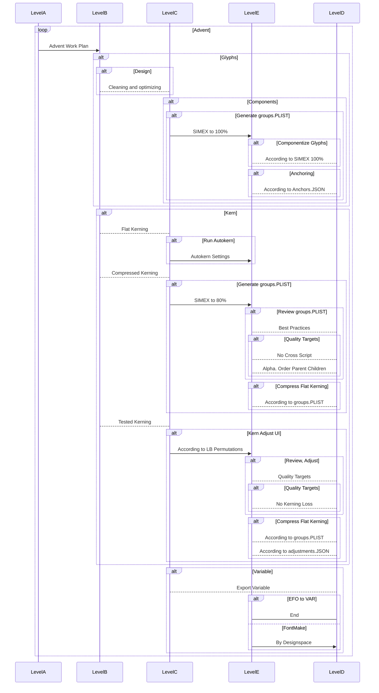

```{include=partials/introduction/profile_project.md,M0}```

---

```{include=partials/p_001_interactivedocumentation.md}```

---

```{include=partials/introduction/phase_introduction/phase_introduction.md,M0}```

---

### **Introduction / Phase Introduction / Initiation Phase**

**Business Case**:

What are the benefits we are trying to get from the project and justification of the decision. It encapsulates the research done to see if the project is worth doing.

---


*  **Initiation Phase** Components ∞0.001:
	
	1.  **Business Case**:
		*  Strategic case
		*  Management case

---

### **Introduction / Phase Introduction / Initiation Phase / Business Case**

```{include=partials/introduction/phase_introduction/initiation_phase/business_case.md}```

---

### **Introduction / Phase Introduction / Initiation Phase / Business Case / Solution Options**

```{include=partials/introduction/phase_introduction/initiation_phase/business_case/solution_options.md}```

---

### **Introduction / Phase Introduction / Initiation Phase / Business Case / Strategic case**

```{include=partials/introduction/phase_introduction/initiation_phase/business_case/strategic_case/strategic_case.md}```

---

### **Introduction / Phase Introduction / Initiation Phase / Business Case / Management case**

```{include=partials/introduction/phase_introduction/initiation_phase/business_case/management_case/management_case.md}```

---

### **Introduction / Phase Introduction / Initiation Phase / Business Case / Management case / Achievements Plan**

```{include=partials/introduction/phase_introduction/initiation_phase/business_case/management_case/achievements_plan.md}```

---

### **Introduction / Phase Introduction / Initiation Phase / Project Charter**


*  **Project Charter** Components ∞0.002:
	*  Project Introduction
	*  Project Goals
	*  Deliverables
	*  Duration

---

### **Introduction / Phase Introduction / Initiation Phase / Project Charter / Project Introduction**

*  **Project Introduction** Components ∞0.002:

	*  Project Name
	*  Project Statements
		*  Vision Statement
		*  Mission Statement
	*  Project Definition
		*  Problem 
		*  Opportunity

---

### **Introduction / Phase Introduction / Initiation Phase / Project Charter / Project Introduction / Project Statements**

```{include=partials/introduction/phase_introduction/initiation_phase/project_charter/project_statements.md}```


---


### **Introduction / Phase Introduction / Initiation Phase / Project Charter / Project Introduction / Project Definition**

*  **Problem** Components ∞0.001:
	*  Problematic Vectors
	*  Dirty Contours
	*  Old Format

*  **Opportunity** Components ∞0.001:
	*  New Variable Font Format
	*  Cleaner Contrours
	*  Compression Concepts
	*  Lighter Offering

---

### **Introduction / Phase Introduction / Initiation Phase / Project Charter / Project Goals**

*  Goals for ∞ 3.000:
	*  To bring an updated Advent Pro to the Variable format, 
	*  Add Italics Axes
	*  Add Weight Axes
*  Goals for ∞ 4.000:
	*  Add Cyrillic
	*  Add Width Axes
	*  Add Optical Size Axes

---


### **Introduction / Phase Introduction / Initiation Phase / Project Charter / Deliverables**

*  **Deliverables** Components ∞0.001:
	*  Advent Pro Variable:
		*  Variation Weight Axes
		*  Variation Italic Axes
	*  Advent Pro 14 Weights:
		*  Classic Formats (TTF, OTF, ...)
	*  VRD-Typography-Library:
		*  EFO to UFOs
		*  UFOs to EFO
		*  EFO to VAR
		*  Kerning Extract Similarity (SIMEX)
		*  Kerning Autokern
		*  Kerning Compress FlatD
		*  Componentize EFO
		*  Kerning Adjust UI

	
---

### **Introduction / Phase Introduction / Initiation Phase / Project Charter / Duration**

*  **Duration** of Advent ∞3.000:
	*  22/08/2018 to 16/02/2019

*  **Duration** of Advent ∞4.000:
	*  April 1st 2019 to December 20th 2019

---


### **Introduction / Phase Introduction / Planning Phase**

The Planning Phase, is where the project solution is further developed in as much detail as possible and the steps necessary to meet the project’s objectives.

The Planning Phase consists of:

1.  **Safe Planning**
1.  **Stakeholders**
1.  **Quality Plan (PQP)**


At this point, the project would have been planned in detail and is ready to be executed.

---

### **Introduction / Phase Introduction / Planning Phase / Safe Planning**

The project's **Work Planning / Project Plan** is created outlining the activities, tasks, dependencies, and timeframes.


*  **Safe Planning** Components (Scope Management): 

	*  Projeect Plan:
	*  Work Planning:
		*  Tasks Assignments
		*  Dependencies
	*  Schedule Planning.
		*  Timeline

---

### **Introduction / Phase Introduction / Planning Phase / Safe Planning / Project Plan**

Decide on the encoding sets and supported language scripts. Decide and plan the weights and how you will generate each weight. Understand the procedures and steps. Calculate or keep track of timelines, steps procedures and pitfalls.

1.  **Project Plan** Components ∞0.001:
	1.  **Design**
	1.  **Production**
	1.  **Masters and Instances**
	1.  **Kerning**
	1.  **Components**
	1.  **Language Scripts and Glyph Range**
	1.  **Features**
	1.  **Delivery**

---

### **Introduction / Phase Introduction / Planning Phase / Safe Planning / Project Plan / Design**

Advent originally featured 7 weights of geometric sharp curved high rise forms and modernized Greek Letters. This realease features 14 weights, the original updated and improved forms along with italics.

---

### **Introduction / Phase Introduction / Planning Phase / Safe Planning / Project Plan / Production**

To produce the font, Illustrator and Fontlab was used originally in 2007, updating to Advent  Pro Variable in 2018, a set of scripts for Adobe Illustrator (JSX) and Fontlab (Python) where written, additionally python scripts and bash, for the composition and kerning. Later on VRD Typography Library was introduced allowing for easier modifications to the font by utilizing a new format - a container for UFO, called the EFO. VRD TYPL for kerning - and compression and Googles fontmake to compile the final variable font. 

Work was done on a Linux box with VirtualBox running Windows 8 and Mac OSX Lion.

---

### **Introduction / Phase Introduction / Planning Phase / Safe Planning / Project Plan / Masters and Instances**

The diagram shows the Original Masters (MO), Generated Masters (MG) that get adjusted manually and the automatically generated instances (MA).


image: #001, 0.002, svg, Advent Masters and Instances sankey.

---

#### Masters

| name                  | weight | size             | version   |
| --------------------- | ------ | ---------------- | --------- |
| Thin Normal           | 100    | 8pt, 24pt, 144pt | 3.000     |
| Regular Normal        | 400    | 8pt, 24pt, 144pt | 3.000     |
| Bold Normal           | 700    | 8pt, 24pt, 144pt | 3.000     |
| Black Normal          | 900    | 8pt, 24pt, 144pt | **4.000** |
| Thin Wide             | 100    | 8pt, 24pt, 144pt | **4.000** |
| Regular Wide          | 400    | 8pt, 24pt, 144pt | **4.000** |
| Bold Wide             | 700    | 8pt, 24pt, 144pt | **4.000** |
| Black Wide            | 900    | 8pt, 24pt, 144pt | **4.000** |
| Thin Italic Normal    | 100    | 8pt, 24pt, 144pt | 3.000     |
| Regular Italic Normal | 400    | 8pt, 24pt, 144pt | 3.000     |
| Bold Italic Normal    | 700    | 8pt, 24pt, 144pt | 3.000     |
| Black Italic Normal   | 900    | 8pt, 24pt, 144pt | **4.000** |
| Thin Italic Wide      | 100    | 8pt, 24pt, 144pt | **4.000** |
| Regular Italic Wide   | 400    | 8pt, 24pt, 144pt | **4.000** |
| Bold Italic Wide      | 700    | 8pt, 24pt, 144pt | **4.000** |
| Black Italic Wide     | 900    | 8pt, 24pt, 144pt | **4.000** |

#### Standard Instances

| acro      | weight | name                                   | master | version   |
| --------- | ------ | -------------------------------------- | ------ | --------- |
| thn       | 100    | Thin (Hairline)                        | MO     | 3.000     |
| reg       | 400    | Regular                                | MO     | 3.000     |
| bld       | 700    | Bold                                   | MO     | 3.000     |
| blk       | 900    | Black (Heavy)                          | MO     | **4.000** |
| thn-wd    | 100    | Ultra Expanded Thin (Hairline)         | MG     | **4.000** |
| reg-wd    | 400    | Ultra Expanded Regular                 | MG     | **4.000** |
| bld-wd    | 700    | Ultra Expanded Bold                    | MG     | **4.000** |
| blk-wd    | 900    | Ultra Expanded Black (Heavy)           | MG     | **4.000** |
| thn-it    | 100    | Italic Thin (Hairline)                 | MG     | 3.000     |
| reg-it    | 400    | Italic Regular                         | MG     | 3.000     |
| bld-it    | 700    | Italic Bold                            | MG     | 3.000     |
| blk-it    | 900    | Black (Heavy)                          | MG     | **4.000** |
| thn-wd-it | 100    | Ultra Expanded Italic Thin (Hairline)  | MG     | **4.000** |
| reg-wd-it | 400    | Ultra Expanded Italic Regular          | MG     | **4.000** |
| bld-wd-it | 700    | Ultra Expanded Italic Bold             | MG     | **4.000** |
| blk-wd-it | 900    | Ultra Expanded Black (Heavy)           | MG     | **4.000** |


#### Extended Instances


| acro      | weight | name                                            | master | version   |
| --------- | ------ | ----------------------------------------------- | ------ | --------- |
| thn       | 100    | Thin (Hairline)                                 | MO     | 3.000     |
| xlg       | 200    | Extra Light (Ultra Light)                       | MA     | **4.001** |
| lgt       | 300    | Light                                           | MA     | **4.001** |
| reg       | 400    | Regular                                         | MO     | 3.000     |
| med       | 500    | Medium                                          | MA     | **4.001** |
| smb       | 600    | Semi Bold (Demi Bold)                           | MA     | **4.001** |
| bld       | 700    | Bold                                            | MO     | 3.000     |
| xbd       | 800    | Extra Bold (Ultra Bold)                         | MA     | **4.001** |
| blk       | 900    | Black (Heavy)                                   | MO     | **4.000** |
| thn-ex    | 100    | Expanded Thin (Hairline)                        | MG     | **4.000** |
| xlg-ex    | 200    | Expanded Extra Light (Ultra Light)              | MA     | **4.001** |
| lgt-ex    | 300    | Expanded Light                                  | MA     | **4.001** |
| reg-ex    | 400    | Expanded Regular                                | MG     | **4.000** |
| med-ex    | 500    | Expanded Medium                                 | MA     | **4.001** |
| smb-ex    | 600    | Expanded Semi Bold (Demi Bold)                  | MA     | **4.001** |
| bld-ex    | 700    | Expanded Bold                                   | MG     | **4.000** |
| xbd-ex    | 800    | Expanded Extra Bold (Ultra Bold)                | MA     | **4.001** |
| blk-ex    | 900    | Expanded Black (Heavy)                          | MG     | **4.000** |
| thn-ux    | 100    | Ultra Expanded Thin (Hairline)                  | MG     | **4.000** |
| xlg-ux    | 200    | Ultra Expanded Extra Light (Ultra Light)        | MA     | **4.001** |
| lgt-ux    | 300    | Ultra Expanded Light                            | MA     | **4.001** |
| reg-ux    | 400    | Ultra Expanded Regular                          | MG     | **4.000** |
| med-ux    | 500    | Ultra Expanded Medium                           | MA     | **4.001** |
| smb-ux    | 600    | Ultra Expanded Semi Bold (Demi Bold)            | MA     | **4.001** |
| bld-ux    | 700    | Ultra Expanded Bold                             | MG     | **4.000** |
| xbd-ux    | 800    | Ultra Expanded Extra Bold (Ultra Bold)          | MA     | **4.001** |
| blk-ux    | 900    | Ultra Expanded Black (Heavy)                    | MG     | **4.000** |
| thn-it    | 100    | Italic Thin (Hairline)                          | MG     | 3.000     |
| xlg-it    | 200    | Italic Extra Light (Ultra Light)                | MA     | **4.001** |
| lgt-it    | 300    | Italic Light                                    | MA     | **4.001** |
| reg-it    | 400    | Italic Regular                                  | MG     | 3.000     |
| med-it    | 500    | Italic Medium                                   | MA     | **4.001** |
| smb-it    | 600    | Italic Semi Bold (Demi Bold)                    | MA     | **4.001** |
| bld-it    | 700    | Italic Bold                                     | MG     | 3.000     |
| xbd-it    | 800    | Extra Bold (Ultra Bold)                         | MA     | **4.001** |
| blk-it    | 900    | Black (Heavy)                                   | MG     | **4.000** |
| thn-ex-it | 100    | Expanded Italic Thin (Hairline)                 | MG     | **4.000** |
| xlg-ex-it | 200    | Expanded Italic Extra Light (Ultra Light)       | MA     | **4.001** |
| lgt-ex-it | 300    | Expanded Italic Light                           | MA     | **4.001** |
| reg-ex-it | 400    | Expanded Italic Regular                         | MG     | **4.000** |
| med-ex-it | 500    | Expanded Italic Medium                          | MA     | **4.001** |
| smb-ex-it | 600    | Expanded Italic Semi Bold (Demi Bold)           | MA     | **4.001** |
| bld-ex-it | 700    | Expanded Italic Bold                            | MG     | **4.000** |
| xbd-ex-it | 800    | Expanded Extra Bold (Ultra Bold)                | MA     | **4.001** |
| blk-ex-it | 900    | Expanded Black (Heavy)                          | MG     | **4.000** |
| thn-ux-it | 100    | Ultra Expanded Italic Thin (Hairline)           | MG     | **4.000** |
| xlg-ux-it | 200    | Ultra Expanded Italic Extra Light (Ultra Light) | MA     | **4.001** |
| lgt-ux-it | 300    | Ultra Expanded Italic Light                     | MA     | **4.001** |
| reg-ux-it | 400    | Ultra Expanded Italic Regular                   | MG     | **4.000** |
| med-ux-it | 500    | Ultra Expanded Italic Medium                    | MA     | **4.001** |
| smb-ux-it | 600    | Ultra Expanded Italic Semi Bold (Demi Bold)     | MA     | **4.001** |
| bld-ux-it | 700    | Ultra Expanded Italic Bold                      | MG     | **4.000** |
| xbd-ux-it | 800    | Ultra Expanded Extra Bold (Ultra Bold)          | MA     | **4.001** |
| blk-ux-it | 900    | Ultra Expanded Black (Heavy)                    | MG     | **4.000** |


#### Axes

Weight:

| Value     | Name            | 
| --------- | --------------- |
| 100       | Thin            |
| 200       | Extra Light     |
| 300       | Light           |
| 400       | Regular         |
| 500       | Medium          |
| 600       | Semi Bold       |
| 700       | Bold            |
| 800       | Extra Bold      |
| 900       | Black           |


Italic:

| Value     | Name            | 
| --------- | --------------- |
| 0         | Plain           |
| 1         | Italic          |


Width:

| Value     | Name            | 
| --------- | --------------- |
| 100       | Normal          |
| 200       | Expanded  |


Axes Design Parameters

```
Weight:

Thin=100, "Extra Light"=200, Light=300, (Regular)=400, Medium=500, "Semi Bold"=600, Bold=700, "Extra Bold"=800, Black=900

Italic:

(Plain)=0, Italic=1

Width:

(Normal)=100, Expanded=200


```

Variable Flavors

| axes                                        | version   |
| ------------------------------------------- | --------- |
| weight axes only                            | 3.000     |
| italic axes with weight axes                | 3.000     |
| weight and italic axes                      | 3.000     |
| weight and width                            | **4.000** |
| width axes only                             | **4.000** |
| italic axes with weight axes and width axes | **4.000** |
| optical size                                | **4.000** |


---


#### Optical Axis

The masters have been set as follows:


| masters            | pt     |
| -------------------| ------ |
| thn                | 170    |
| reg                | 55     |
| bld                | 28     |
| blk                | 17     |


image: #003, 0.001, svg, Advent Optical Size Axis (opsz), chart.


---

### **Introduction / Phase Introduction / Planning Phase / Safe Planning / Project Plan / Kerning**

With the help of Typefacet Integrated Autokern, we have obtained the first layer of kerning for the upright bold.
By using VRD TYPL Kerning Adjust, 
we made the corrections, and the rest of the optimisations required per weight.

We have Classified our glyphs in a way where no kerning loss is observed. By dividing by Language Set, without language intrusion between classes.
Small Case and Capitals are also non intruding. This increases size minimally but maintains kerning pair loss at zero.

During the process we attempted to maintain the Italics width according to the contour. This created a larger alteration size and jittering italics transition due to changing width - even if the kerning was precise. We eventually opted for the slant-to-right-side-corner and maintained the regular kerning along to the italics and smoother animation on Italics.

---

### **Introduction / Phase Introduction / Planning Phase / Safe Planning / Project Plan / Kerning / Standard Sets**

All the letter combinations have been kerned but we also perform testing afterwards, for various reasons (Ommited) some kerning pairs are not included. This brings us to testing the kerning on a specific set of letters, the other letters are left to maintain the mechanical, automated kerning.

VivaRado standard kerning sets are defined as follows:

 - Letter Based(LB):

	- Latin Capitals(LBLC):
	  - ```A B C D E F G H I J K L M N O P Q R S T U V W X Y Z```
	- Latin SmallCase(LBLS):
	  - ```a b c d e f g h i j k l m n o p q r s t u v w x y```
	- Greek (GREEK UNICODES)(LBGC):
	  - ```Α Β Γ Δ Ε Ζ Η Θ Ι Κ Λ Μ Ν Ξ Ο Π Ρ Σ Τ Υ Φ Χ Ψ Ω```
	- Greek SmallCase(LBGS):
	  - ```α β γ δ ε ζ η θ ι κ λ μ ν ξ ο π ρ σ ς τ υ φ χ ψ ω```
	- Numbers(LBNU):
	  - ```0 1 2 3 4 5 6 7 8 9```

 - Resulting Permutations that have been Adjusted:

	- Letter Based Permutations (LB):

	  - Latin VS Latin Capitals Letter Based Permutation (LBLCLC)
	  - Latin VS Latin SmallCase Letter Based Permutation (LBLSLS)
	  - Latin Capitals VS Latin SmallCase Letter Based Permutation (LBLCLS)

	  - Greek VS Greek Capitals Letter Based Permutation (LBGCGC)
	  - Greek VS Greek SmallCase Letter Based Permutation (LBGSGS)
	  - Greek Capitals VS Greek SmallCase Letter Based Permutation (LBGCGS)

 - Letter to Letter Adjustments:
	- These are small adjustments due to design quirks, and when we decide that a glyph doesn't fit into classes or the class is not satisfying the kerning requirements completely.
 - Ommited:
	- Cross Language System Kerning (grek to latn and latn to grek).
	- Greek "sigma1" on the Left Side for all Greek.


Version >4.000 is pending Cyrillic Kerning.

---

### **Introduction / Phase Introduction / Planning Phase / Safe Planning / Project Plan / Kerning / Results**

The resulting kerning is:

```{'GG': 4458, 'GL': 761, 'LG': 708, 'LL': 166}```

Total Pairs: ```6093```


More information in: [Kerning Pair Details](https://github.com/VivaRado/Advent/blob/master/docs/kerning_adjustments/kerning_pair_details)

**If you notice a possible kerning improvement we would like to hear about it.**

---

### **Introduction / Phase Introduction / Planning Phase / Safe Planning / Project Plan / Components**

Components are created by first running VRD/TYPL/SIMEX to obtain a component similarity index, then VRD/TYPL/COMPONENTS to Componentize the EFO,
later you can export to Componentized UFOs.

---

### **Introduction / Phase Introduction / Planning Phase / Safe Planning / Project Plan / Scripts**

At this moment advent supports Latin, and Greek Encoding as ∞3.000.

*  **Version ∞3.000**:
	*  **Current Character Support:**
		*  *Latin*
		*  *Extended Latin*
		*  *Greek*
		*  *Baltic*
		*  *Turkish*

	*  **Intended Character Support:**

		*  The Proposed Encoding/Glyph List: /encoding_list/suggested_encoding.py
		*  Current Encoding/Glyph List: /encoding_list/current_encoding.enc

*  **Version ∞4.000**:
	*  *Google Latin Plus*
	*  *Google Cyrillic Plus*
	*  *Google Greek*
	*  *Opentype Features Glyphs*

[Encoding NAM Files](https://github.com/googlefonts/gftools/tree/master/Lib/gftools/encodings)

---

#### Script Expansion

During script expansion (SE), we have a NAM file, with unicode and name information [located here](README/plans/ADV3_SeC_integration). And the appropriate MO PDF files for each weight or MO. The work takes place per MO or weight, per glyph and the appropriate procedues take place. The MG (Generated Masters) don't need new vectors, just adjustments so those masters don't have PDF files with vectors. The task is then to position the vectors in the font. While working with the plans we update them to reflect the given changes. At the same time we repair any notable contour fixes, width fixes and whatever we see that is out of order.

We have divided the vector integration work to given procedures:

*  GP (Glyph Placement)
*  WA (Width Adjustment)
*  GF (Glyph Fix)

---

**Glyph Placement**:

When dealing with a MO (Original Master), we initially position the vectors in the font, without any worry for width. Glyph Placement also deals with assigning components.

**Width Adjustment**:

This deals with the adjustment of the glyph width where we determine if we have similar looking glyphs and transfer the width to the newly added glyph.

**Glyph Fix**:

This is intended for the MG (Generated Masters), like italics or wide version where we keep the original glyphs but adjust them after applying an effect like slant or width.

#### Glyph Distributor

For integrating the glyphs to the EFO we use the Glyph Distributor, it is responsible for taking glif files from provided UFO and placing it to the appropriate EFO directory. Updating the glyphlib and the contents file.


---

From the ADV3_SeC_integration file:

```
1024 0x0400 Ѐ CYRILLIC CAPITAL LETTER IE WITH GRAVE False
	GP_MG (thn,reg,bld), 
	WA_MO (thn,reg,bld), 
	GF_MG (thn_it,reg_it,bld_it), 
	WA_MG (thn_it,reg_it,bld_it)
```

We can then see that this glyph has been updated with the following procedures:

*  GP_MG (Glyph Placement):
	*  Component from existing glyphs like "E". This glyph has been placed for three Generated Masters (thn,reg,bld)
*  WA_MO (Width Adjustment):
	*  Widths (bearings) have been adjusted. This glyph widths have been adjusted for three Original Masters (thn,reg,bld)
*  GF_MG (Glyph Fix):
	*  This glyph was fixed after application of an effect like slant or width. This glyph has been fixed for three Generated Masters (thn_it,reg_it,bld_it)
*  WA_MG (Width Adjustment):
	*  Widths (bearings) have been adjusted. This glyph widths have been adjusted for three Generated Masters (thn_it,reg_it,bld_it)


---

### **Introduction / Phase Introduction / Planning Phase / Safe Planning / Project Plan / Glyphs**

*  **Version ∞3.000**:
	
	The glyph range is ≃ 391

*  **Version ∞4.000**:
	
	The glyph range is ≃ 647

---

### **Introduction / Phase Introduction / Planning Phase / Safe Planning / Project Plan / Features**

Advent features at this moment include:

*  liga:

	*  sub f l by fl;
	*  sub f i by fi;
	*  sub f f l by ffl;
	*  sub f t by ft;
	*  sub t t by t_t;
	*  sub w w w by w_w_w;
	*  sub gamma gamma by gamma_gamma;
	*  sub gamma kappa by gamma_kappa;
	*  sub lambda lambda by lambda_lambda;

---

### **Introduction / Phase Introduction / Planning Phase / Safe Planning / Project Plan / Hinting**

TrueType Hints

---

### **Introduction / Phase Introduction / Planning Phase / Safe Planning / Project Plan / Delivery**

Advent Pro Variable is delivered in 4 weight, 8 italic and 4 width Masters, variable formats come in flavors with segmented axes and a definitive version which includes all axes (wght,wdth,ital).

The delivered font files are provided in UFO, OTF, EFO and VAR TTF

[All the above files are available here](https://github.com/VivaRado/Advent/blob/master/font_source/UFOs).

To keep things simple for the initial release, we don't generate intermediate instances as standalone OTFs, this brings the total of available weights deriving from only the masters to 16. If any intermediate instances offered are present they may be lagging behind those main 16. The available OTF files are 16 for Standard release and 54 for Extended Release. For all other formats we offer only the standard release.

---

### **Introduction / Phase Introduction / Planning Phase / Safe Planning / Project Plan / Usage**

[Variable format versions](https://github.com/VivaRado/Advent/blob/master/font_source/VAR).

#### **To compile from UFO**

```fontmake -o variable -m '/font.designspace' --output-path '/adventpro-VF.ttf'```

#### **Or from EFO**

```python3 '/efo_to_var.py' -s '/font_source/EFO' -o '/adventpro-VF.ttf'```

#### **Compiled Using**

```
fonttools==4.0.0
cu2qu==1.6.6
ufo2ft==2.9.0
defcon==0.6.0
```

#### **Compiling specific flavor**

Advent 4 with the introduction of a new axes and a new weight (wide and black), comes in flavored designspace files where those masters are partitioned. You can find the designspaces for advent 4 in ```font_source/UFOs``` labeled as **adv4**.

* **Designspace Flavors:**
	* Active:
		* **weight [adv4\_wght](https://github.com/VivaRado/Advent/blob/master/font_source/UFOs/latest/adv_wght.designspace)**
			* Thin through Black, Only Normal Width, Only Non Italic.
			* Weight axes only.

		* **weight and width [adv4\_wght\_wdth](https://github.com/VivaRado/Advent/blob/master/font_source/UFOs/latest/adv_wght_wdth.designspace)**
			* Thin through Black, Normal through Expanded Width, Only Non Italic.
			* Weight axes and Width axes.

		* **weight and ital [adv4\_wght\_ital](https://github.com/VivaRado/Advent/blob/master/font_source/UFOs/latest/adv_wght_ital.designspace)**
			* Thin through Black, Only Normal Width, Non Italic through Italic.
			* Weight axes and Italic axes.

		* **weight,width,ital (DEFINITIVE) [adv4\_wght\_wdth\_ital](https://github.com/VivaRado/Advent/blob/master/font_source/UFOs/latest/adv_wght_wdth_ital.designspace)**
			* Thin through Black, Normal through Expanded Width, Non Italic through Italic.
			* Weight axes, Italic axes and Width axes.

		* **weight,width,ital,opsz [adv4\_wght\_wdth\_ital\_opsz](https://github.com/VivaRado/Advent/blob/master/font_source/UFOs/latest/adv_wght_wdth_ital_opsz.designspace)**
			* Thin through Black, Normal through Expanded Width, Non Italic through Italic.
			* Weight axes, Italic axes and Width axes.
			* Optical Size

	* Preset:
		* **weight, pre ital [adv4\_wght\_preital](https://github.com/VivaRado/Advent/blob/master/font_source/UFOs/latest/adv_wght_preital.designspace)**
			* Thin through Black, Only Normal Width, Only Italic.
			* Weight axes but instances are preset to italic.

		* **weight, pre width [adv4\_wght\_prewdth](https://github.com/VivaRado/Advent/blob/master/font_source/UFOs/latest/adv_wght_prewdth.designspace)**
			* Thin through Black, Only Expanded Width, Only Non Italic.
			* Weight axes but instances are preset to Expanded Width.

		* **weight, pre width, pre ital [adv4\_wght\_prewdth\_preital](https://github.com/VivaRado/Advent/blob/master/font_source/UFOs/latest/adv_wght_prewdth_preital.designspace)**
			* Thin through Black, Only Expanded Width, Only Italic.
			* Weight axes but instances are preset to Expanded Width and are preset to Italic.

		* **weight and width, pre italic [adv4\_wght\_wdth\_preital](https://github.com/VivaRado/Advent/blob/master/font_source/UFOs/latest/adv_wght_wdth_preital.designspace)**
			* Thin through Black, Normal through Expanded Width, Only Non Italic.
			* Weight axes and Width axes but instances are preset to Italic.

		* **weight and ital, pre width [adv4\_wght\_ital\_prewdth](https://github.com/VivaRado/Advent/blob/master/font_source/UFOs/latest/adv_wght_ital_prewdth.designspace)**
			* Thin through Black, Only Expanded Width, Non Italic through Italic.
			* Weight axes and Italic axes but instances are preset to Expanded Width.

#### **Compiling Everything**

You can find ```font_source/compile_latest_variable_flavors.sh```, By modifying to your needs, you can compile each of the above versions.


---

### **Introduction / Phase Introduction / Planning Phase / Safe Planning / Work Planning**


#### Kerning Work Breakdown Structure


diagram: #006, ∞0.001, mermaid, Work Breakdown Structure of Advent for Kerning.

---


### **Introduction / Phase Introduction / Planning Phase / Safe Planning / Work Planning / Task Assignments**

*  **Assumptions Research**:
	*  VivaRado, Andreas Kalpakidis (∞3,4)
*  **Docs Update**:
	*  VivaRado, Andreas Kalpakidis (∞3,4):
		*  Identify Dependencies
		*  Identify Resource Requirements
	*  VivaRado, Madina Akhmatova (∞3,4)
*  **Advent**:
	*  **Design**
		*  VivaRado, Andreas Kalpakidis (∞1,2,3,4)
	*  **Componentization**
		*  VivaRado, Andreas Kalpakidis (∞3,4)
		*  Michael La Gatutta (∞3)
	*  **Kerning**
		*  VivaRado, Andreas Kalpakidis (∞3,4):
			*  Build
			*  Test
		*  Michael La Gatutta (∞3):
			*  Best Practices
*  **VRD TYPL**:
	*  VivaRado, Andreas Kalpakidis (∞3,4):
		*  Build
		*  Test
	*  VivaRado, Madina Akhmatova (∞3,4):
		*  Compression Logic

---

### **Introduction / Phase Introduction / Planning Phase / Safe Planning / Work Planning / Dependencies**

For the kerning we depend on TypeFacet Autokern.

---

### **Introduction / Phase Introduction / Planning Phase / Safe Planning / Schedule Planning**

```{include=partials/introduction/phase_introduction/planning_phase/safe_planning/schedule_planning.md}```

---

### **Introduction / Phase Introduction / Planning Phase / Safe Planning / Schedule Planning / Timeline**

```{include=partials/introduction/phase_introduction/planning_phase/safe_planning/schedule_planning_timeline.md}```

---


### **Introduction / Phase Introduction / Planning Phase / Stakeholders**

We identify the **Stakeholders** by a **Personnel Plan** and create a **Communication Plan** to keep the **Stakeholders** informed.


*  **Stakeholders** Components:

	*  Applicable Stakeholders (Concious and Unconcious Entities):
		*  clients
		*  personell
		*  funders
		*  suppliers
		*  equipment
	*  Glyph Design Team (Gdes)
	*  Kern Testing Team (KeT)
	*  Quality Assurance Team (QaT)

### **Introduction / Phase Introduction / Planning Phase / Stakeholders / Personnel Plan**

*  Personnel Plan
	*  Organizational Structure
		*  team members
			*  internal
				*  Andreas Kalpakidis (∞1,2,3,4)
				*  Madina Akhmatova (∞3,4)
			*  external
				*  Michael La Gatutta (∞3)
	*  Responsibilities and Qualifications
		*  Project Management and Accounting: Madina Akhmatova (∞3,4)
		*  Planning, Development and Design: Andreas Kalpakidis (∞3,4)
		*  Quality Assurance and Consulting: Michael La Gatutta (∞3)
		*  Acceptance: Dave Crossland (∞2,3,4)

---

### **Introduction / Phase Introduction / Planning Phase / Stakeholders / Communication Plan**

*  Communication Plan
	*  Stakeholder Feedback Mechanisms
		*  Weekly Notifications
		*  VRD Forum
		*  Interactive Documentation
	*  User Feedback Mechanisms:
		*  <support@vivarado.com>

---


### **Introduction / Phase Introduction / Planning Phase / Quality Plan**

A **Quality Plan** describes the activities, standards, tools and processes necessary to achieve quality in the delivery of a project.

We can now create a **Quality Plan** by identifying the valid **Quality Targets** we want to achieve. Identify the **Quality Policies** that will be required to achieve them. Identify how to do **Quality Measurement**. Lastly identify how to maintain quality with **Quality Management**.


*  **Quality Plan (PQP)** Components:
	
	1.  Quality Targets
	1.  Quality Management

---

### **Introduction / Phase Introduction / Planning Phase / Quality Plan / Quality Targets**

**Quality Targets** we want to achieve and what are their **Acceptance Criteria**, **Quality Management Procedures**, for each **Applicable Category**

1.  Quality Targets Components:
	*  Acceptance criteria
		*  Glyphs
			*  Contour Components
				*  Alligned Accents.
				*  Components.
			*  Contour Quality
				*  Point Minimisation.
				*  Extremas.
		*  Kerning
			*  Kerning Loss
				*  No Loss on Standard Set permutations.
				*  Alpha. Order Parent Children
	*  Quality Management procedures
		*  Kerning
			*  Kerning Loss
				*  Kern Adjust Interface Screenshots before and after compression.

---

### **Introduction / Phase Introduction / Planning Phase / Quality Plan / Quality Management**

**Quality Management**, the nature of the **Audits**, **Work Verification** by assigning responsible personnel for **Task Fulfillment** and **Task Checking**.

1.  Quality Management
	*  Audits
	*  Tool Scheduling
	*  Work Verification
		*  Task fulfillment responsible personnel 
			*  VivaRado
		*  Task checking responsible personnel
			*  VivaRado and Google Fonts


---

